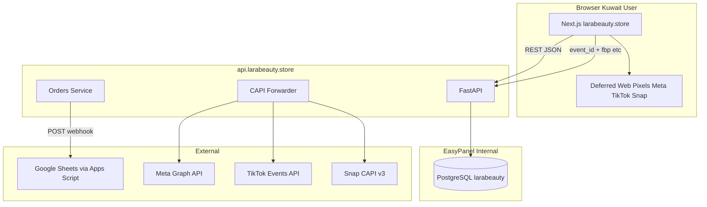

# 07 — Architecture

## System diagram



## Request flows

### Add to cart (client-only)

Zustand cart in `localStorage` — no API until checkout.

### Place order

1. `POST /api/v1/orders` with cart, customer, `event_id`, attribution cookies
2. Backend saves order → returns `order_id`
3. Backend async: Sheets webhook + CAPI Purchase (hashed PII)
4. Frontend: thank you redirect + Purchase pixel (same `event_id`)

### Products list

- `GET /api/v1/products` — seeded from DB migration
- Frontend ISR/revalidate 3600s or on-demand

## Frontend folder structure

```
frontend/
├── Dockerfile
├── .env.example
├── next.config.ts
├── package.json
├── public/images/sample/
└── src/
    ├── app/
    │   ├── layout.tsx          # RTL, fonts, deferred pixels
    │   ├── page.tsx            # Home
    │   ├── collection/page.tsx
    │   ├── products/[slug]/page.tsx
    │   ├── about/page.tsx
    │   ├── contact/page.tsx
    │   ├── thank-you/page.tsx
    │   └── (legal)/...
    ├── components/
    │   ├── layout/Header.tsx Footer.tsx
    │   ├── cart/CartDrawer.tsx
    │   ├── checkout/CheckoutDialog.tsx UpsellOverlay.tsx
    │   ├── product/BundleSelector.tsx ProductSections.tsx
    │   └── tracking/PixelProvider.tsx
    ├── lib/
    │   ├── api.ts
    │   ├── phone.ts              # Kuwait validation
    │   ├── tracking/web.ts       # deferred pixels
    │   └── utils.ts
    └── store/cart.ts             # Zustand
```

## Backend folder structure

```
backend/
├── Dockerfile
├── .env.example
├── alembic.ini
├── alembic/versions/
├── scripts/entrypoint.sh         # migrate then uvicorn
└── app/
    ├── main.py
    ├── config.py
    ├── db.py
    ├── models/
    ├── schemas/
    ├── routers/
    │   ├── products.py
    │   ├── orders.py
    │   └── tracking.py           # optional server events from FE
    ├── services/
    │   ├── sheets.py
    │   ├── capi_meta.py
    │   ├── capi_tiktok.py
    │   └── capi_snap.py
    └── utils/hash_pii.py
```

## Security

- CORS: allow only `https://larabeauty.store` (+ localhost dev)
- Rate limit orders: 5/min per IP
- Validate all prices server-side from DB — **never trust client price**
- Webhook secret for Sheets script callback (optional HMAC)

## Caching

- Product catalog: CDN + `Cache-Control` on GET products
- No cache on POST orders
