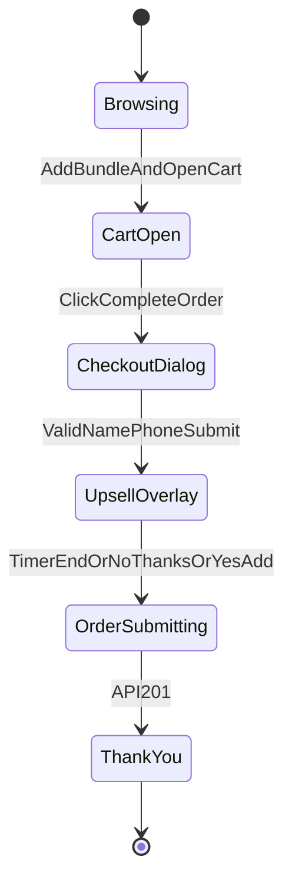

# 12 — Cart & Checkout Flow

## State machine



## Step 1 — PDP bundle + CTA

**UI:** Bundle selector (3 radio cards)

| bundle_id | Label AR | Price |
|-----------|----------|-------|
| bundle_1 | علبة واحدة | 16 د.ك |
| bundle_2 | عبوتين — الأكثر اختياراً | 23 د.ك |
| bundle_3 | 3 علبات — الأوفر | 29 د.ك |

**CTA text:** `أضيف للسلة وافتح السلة`

**Actions:**
1. `cart.addBundle(product, bundleId)`
2. `cart.setDrawerOpen(true)`
3. `track('AddToCart', { value, currency: 'KWD', content_ids })`

## Step 2 — Cart drawer

**Position:** RTL sheet from start (left side visually in RTL)

**Contents:**
- Line items list (image thumb, name, bundle label, price)
- Cross-sell section: up to 2 cards — products not in cart
  - Quick add adds **bundle_1** of that product OR single piece at 16? → **Use bundle_1 (16 KWD)** for cross-sell simplicity
- Subtotal
- Trust: COD + delivery
- CTA: `إتمام الطلب` → opens CheckoutDialog (drawer can stay open behind or close — prefer close drawer, open dialog)

## Step 3 — Checkout dialog

**Fields:**
| Field | Validation |
|-------|------------|
| الاسم الكامل | min 2 words or 3 chars |
| رقم الهاتف | Kuwait mobile — see below |

**Kuwait phone validation logic:**

```ts
function normalizeKuwaitPhone(input: string): string | null {
  const digits = input.replace(/\D/g, '');
  // Accept: 51234567, 96551234567, 0096551234567, +96551234567
  let local = digits;
  if (local.startsWith('965')) local = local.slice(3);
  if (local.startsWith('00')) local = local.replace(/^00/, '');
  if (local.length === 8 && /^[569]/.test(local)) return '965' + local;
  return null;
}
```

**Order summary in dialog:**
- All lines + prices
- Total KWD bold
- Scarcity: "الطلبات بهالسعر محدودة اليوم"
- Social proof: "أكثر من ٣٠٠٠ عميلة في الكويت" (adjust when real)

**Submit CTA:** `تأكيد الطلب — الدفع عند الاستلام`

On valid submit → **do not call API yet** → open UpsellOverlay

## Step 4 — Upsell overlay (10–15 seconds)

**Config:** `UPSELL_DURATION_MS = 15000`

**Content:**
- Headline: "عرض خاص قبل إرسال طلبك!"
- Product: cross-sell #1 not in cart
- Price: **9 د.ك** (strikethrough 16)
- Countdown bar
- Primary: `نعم، أضيف بـ 9 د.ك`
- Secondary: `لا شكراً، أكمل طلبي`

**Behavior:**
| Action | Result |
|--------|--------|
| Yes | Set `upsell.accepted = true`, attach upsell line |
| No | `upsell.accepted = false` |
| Timer end | Same as No |
| Then | `POST /api/v1/orders` once (idempotency key) |

## Step 5 — API + pixels

1. Generate `event_id` at start of checkout (reuse for Purchase)
2. On success → redirect `/thank-you?order=LB-...`
3. Fire **Purchase** web pixel with same `event_id`
4. Backend fires CAPI Purchase with hashed phone/name

## Step 6 — Thank you page

- Show order number
- "بنتصل فيك على {phone} لتأكيد الطلب"
- Expected delivery copy
- Optional: share WhatsApp support button

## Edge cases

| Case | Handling |
|------|----------|
| Double click submit | Disable button + idempotency key |
| API fail | Toast "صار خطأ — جربي مرة ثانية" keep cart |
| Empty cart checkout | Disable CTA |
| Same product twice | Merge lines or increment qty — **merge same product+bundle** |

## Cross-sell in cart vs upsell

| Location | Price | Products |
|----------|-------|----------|
| Cart drawer | Full bundle_1 (16) or show "أضيف بـ 16 د.ك" | 2 cross-sells |
| Upsell modal | **9 KWD only** | 1 cross-sell |
