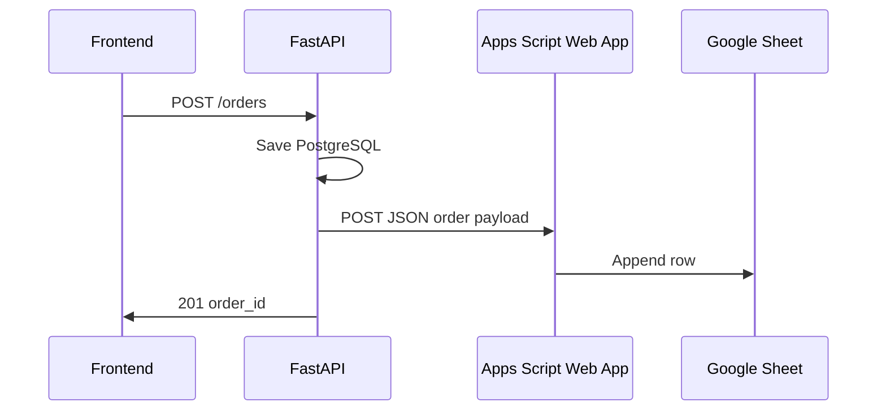

# 15 — Google Sheets Integration

## Flow



## Sheet setup

1. Create Google Sheet: **Lara Beauty Orders**
2. Import headers from `sheets/orders-template.csv` (row 1)
3. Extensions → Apps Script → paste `sheets/google-apps-script.js`
4. Deploy → New deployment → Web app
   - Execute as: Me
   - Who has access: Anyone (or Anyone with link — required for server POST)
5. Copy Web App URL → backend env `GOOGLE_SHEETS_WEBHOOK_URL`

## Webhook payload (backend → Apps Script)

```json
{
  "secret": "your-shared-secret",
  "order_number": "LB-20260601-00042",
  "created_at": "2026-06-01T18:30:00+03:00",
  "customer_name": "فاطمة",
  "customer_phone": "96551234567",
  "products_summary_ar": "مغنيسيوم x2 | تركيز upsell",
  "lines_json": "[{...}]",
  "subtotal_kwd": 23.0,
  "upsell_kwd": 9.0,
  "total_kwd": 32.0,
  "currency": "KWD",
  "status": "pending_confirmation",
  "source_url": "https://larabeauty.store/products/...",
  "utm_campaign": "",
  "event_id": "evt_..."
}
```

## Column reference

See `sheets/orders-template.csv` for exact column order.

## Retry policy

If Sheets POST fails:
- Set `sheet_synced = false` on order
- Log error
- Optional cron endpoint `POST /api/v1/admin/retry-sheets` (protect with secret) — v1.1

## Security

- Shared secret in JSON body; Apps Script validates `secret` against `ScriptProperties`
- Do not expose secret in frontend

## Apps Script file

Implement in repo: `sheets/google-apps-script.js` — AI coder copies to Google Apps Script editor.
